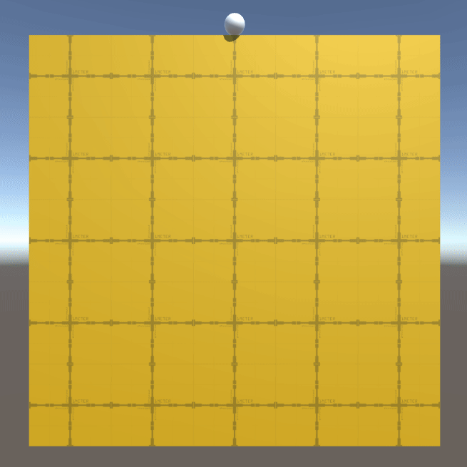
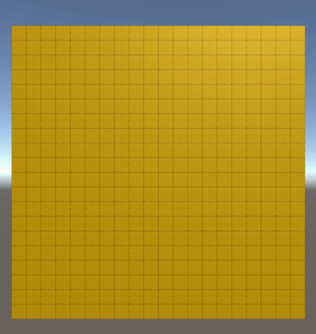

# Sand Balls Mechanic: Mesh Deformation Performance Test

The repository contains implementation of Sand Balls mechanic using different approaches to deform a mesh.
The goal is to play around with [MeshData API](https://docs.unity3d.com/2020.1/Documentation/ScriptReference/Mesh.MeshData.html) and compute shader with [AsyncGPUReadback](https://docs.unity3d.com/ScriptReference/Rendering.AsyncGPUReadback.html).
And then compare its performance to other approaches.

The following samples were implemented:
- [Naive implementation](https://github.com/AlexMerzlikin/SandBallsMechanic-MeshDeformationPerformanceTest/blob/master/Assets/Scripts/Core/Basic/DeformableMeshPlane.cs)
- [Naive implementation using ProBuilder Mesh](https://github.com/AlexMerzlikin/SandBallsMechanic-MeshDeformationPerformanceTest/blob/master/Assets/Scripts/Core/Basic/DeformableProBuilderMeshPlane.cs)
- [Jobified naive implementation](https://github.com/AlexMerzlikin/SandBallsMechanic-MeshDeformationPerformanceTest/blob/master/Assets/Scripts/Core/JobDeformer/JobDeformableMeshPlane.cs)
- [Compute shader with AsyncGPUReadback](https://github.com/AlexMerzlikin/SandBallsMechanic-MeshDeformationPerformanceTest/blob/master/Assets/Scripts/Core/ComputeShaderDeformer/ComputeShaderAsyncGpuReadbackDeformablePlane.cs)
- [MeshData modification on the main thread for easier debugging](https://github.com/AlexMerzlikin/SandBallsMechanic-MeshDeformationPerformanceTest/blob/master/Assets/Scripts/Core/MeshData/MeshDataOnCPU/DeformableMeshDataSingleThread.cs)
- [MeshData modification using jobs](https://github.com/AlexMerzlikin/SandBallsMechanic-MeshDeformationPerformanceTest/blob/master/Assets/Scripts/Core/MeshData/JobDeformableMeshDataPlane.cs)

Each sample can be found inside the [Scenes](https://github.com/AlexMerzlikin/SandBallsMechanic-MeshDeformationPerformanceTest/tree/master/Assets/Scenes) folder

## Perforormance Test Results
### Performance Test Run Example

### Results
Run on OnePlus 9 (Snapdragon 888, VSync on (forced), 120Hz refresh rate)
|                                            Method |   Median |      Dev |   StdDev |
|---------------------------------------------------|---------:|---------:|---------:|
| DeformableMeshPlane_ComputeShader_PerformanceTest | 8,27 ms  | 0,43 ms  | 3,53 ms  |
| DeformableMeshPlane_Naive_PerformanceTest         | 8,27 ms  | 0,39 ms  | 3,25 ms  |
| DeformableMeshPlane_NaiveJob_PerformanceTest      | 8,27 ms  | 0,19 ms  | 1,58 ms  |

Run on Intel Core i7-8750H CPU 2.20GHz (Coffee Lake), 1 CPU, 12 logical and 6 physical cores
NVIDIA GeForce GTX 1070
|                                            Method |   Median |      Dev |   StdDev |
|---------------------------------------------------|---------:|---------:|---------:|
| DeformableMeshPlane_ComputeShader_PerformanceTest | 1,37  ms | 3,91 ms  | 5,66 ms  |
| DeformableMeshPlane_Naive_PerformanceTest         | 15,37 ms | 0,11 ms  | 1,65 ms  |
| DeformableMeshPlane_NaiveJob_PerformanceTest      | 6,76  ms | 0,88 ms  | 5,97 ms  |

More details and the conclusion in [the blog post](https://gamedev.center/sand-balls-mechanic-implementation-how-to-deform-a-mesh-the-most-performant-way-part-1/#performance_tests).
